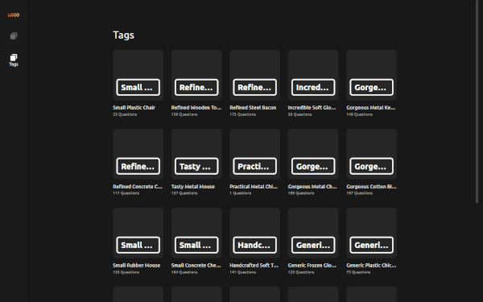
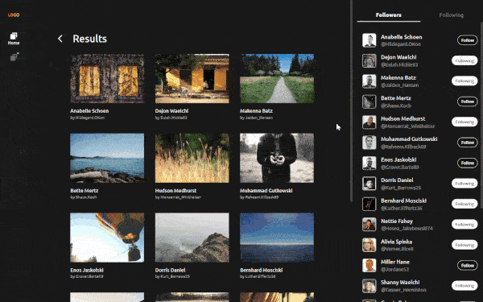
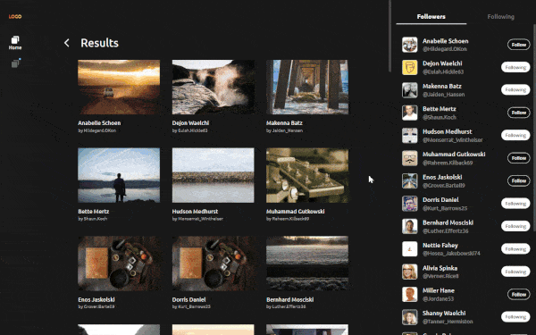
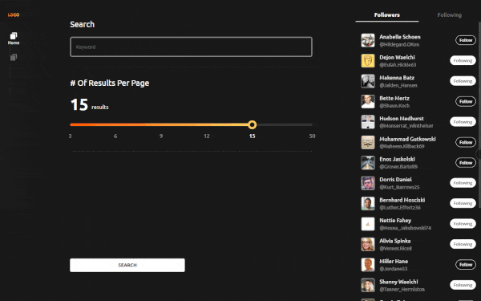
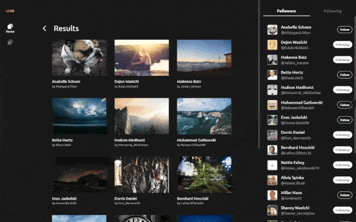
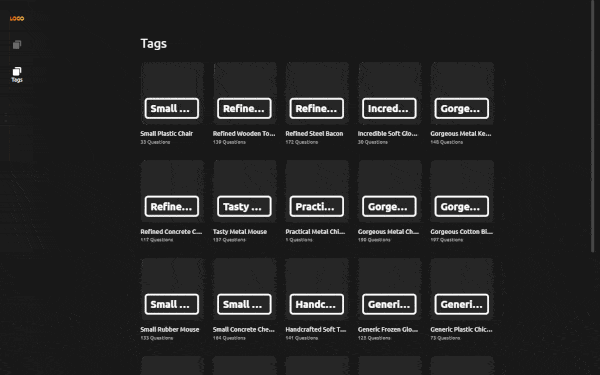

# Aha Front-End Assessment

A showcase website demonstrating front-end development skills for Aha's assessment.

Visit live site: <https://aha-frontend-assessment.web.app/>

## Assessment

This project follows [these instructions](https://rootdomain.notion.site/Candidate-Exam-Front-End-Engineer-ac3dd8a3474542899d49efb894672246) and is built according to [this Figma design](<https://www.figma.com/file/Vuu52JkGcLb3m3uVvF3DA3/Aha-Front-end-Assessment-(clone)?type=design&node-id=0%3A1&mode=design&t=kKtr558af85zwltM-1>) to complete the assessment tasks.

For a detailed side-by-side comparison of the design and implementation, [click here](<https://www.figma.com/file/Vuu52JkGcLb3m3uVvF3DA3/Aha-Front-end-Assessment-(clone)?type=design&node-id=25101%3A309&mode=design&t=mfH6vNOlPhpAZRO1-1>). The differences between the design and implementation are explained in the comments.

## Tech Stack

- Build with [React](https://react.dev/) and [TypeScript](https://www.typescriptlang.org/).
- Adopt the [Vitamin](https://github.com/wtchnm/Vitamin) template, which utilizes [Vite](https://vitejs.dev/) as a build tool and incorporates best practices for React projects.
- Ensure code consistency and formatting with [ESLint](https://eslint.org/) and [Prettier](https://prettier.io/), and integrate them into the workflow via [Husky](https://github.com/typicode/husky) and [lint-staged](https://github.com/okonet/lint-staged).
- Utilize [TanStack Query](https://tanstack.com/query) for efficient data fetching, caching, and synchronization.
- Use [React Router](https://reactrouter.com/) for code-splitting and lazy-loaded routes.
- Style using the atomic approach with [Tailwind CSS](https://tailwindcss.com/), alongside [clsx](https://github.com/lukeed/clsx) and [tailwind-merge](https://github.com/dcastil/tailwind-merge), to prevent style conflicts and enhance readability.
- Leverage [Material UI](https://mui.com/material-ui/) for ready-to-use components.
- Implement grid layout using CSS Grid.
- Automate deployment to [Firebase Hosting](https://firebase.google.com/docs/hosting) through [GitHub Actions](https://docs.github.com/en/actions) for continuous integration.
- Adopt an atomic approach to state management with [Jotai](https://jotai.org/).
- Generate realistic images and avatars with [Faker](https://fakerjs.dev/).
- Use [react-intersection-observer](https://github.com/thebuilder/react-intersection-observer) to achieve infinite loading and lazy load images.
- Implement self-hosted fonts using [Fontsource](https://fontsource.org/).

## Features

### Skeleton

### Infinite scrolling

### Lazy load images

### Responsive Web Design (RWD) across all pages

### Other features

- Code-splitting and lazy-loaded routes
- Dynamic document title

## TODO

- Error handling
- Testing
